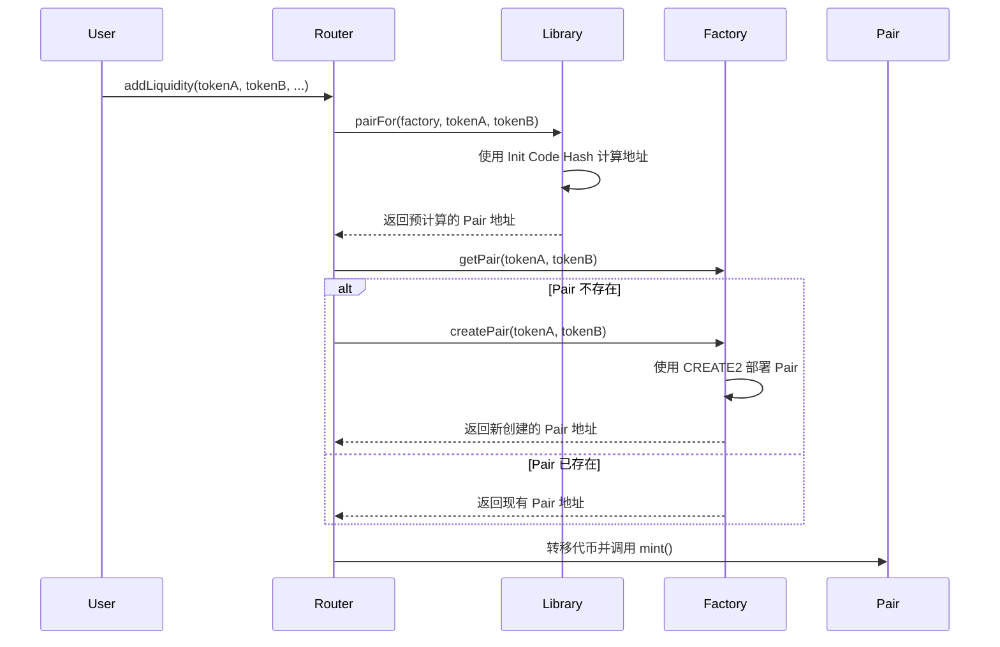

# Init Code Hash 在 Uniswap V2 中的深度解析

## 1. 为什么需要 Init Code Hash？

### 1.1 核心问题：如何在不部署合约的情况下知道合约地址？

在 Uniswap V2 中，有一个关键的设计需求：**在交易对（Pair）合约还没有被创建之前，就需要知道它的地址**。

这个需求来自于以下场景：
- 用户想要添加流动性到一个还不存在的交易对
- Router 需要计算代币交换的路径和数量
- 需要预先验证交易的有效性

### 1.2 传统方案的问题

如果没有 CREATE2 和 Init Code Hash，我们只能：
```solidity
// 传统方案：必须先创建合约才能知道地址
address pair = factory.createPair(tokenA, tokenB);  // 必须先部署
// 然后才能使用这个地址
```

这种方案的问题：
- **Gas 浪费**：即使只是查询，也必须先部署合约
- **用户体验差**：需要两步操作（先创建，再使用）
- **原子性问题**：无法在一个交易中完成创建和使用

## 2. CREATE2 的解决方案

### 2.1 CREATE2 的魔力

CREATE2 允许我们**确定性地计算**合约地址：

```solidity
address = keccak256(0xff + deployer + salt + keccak256(initCode))[12:]
```

其中：
- `0xff`：CREATE2 的标识符
- `deployer`：部署者地址（Factory 合约）
- `salt`：盐值（通常是 token0 和 token1 的组合）
- `keccak256(initCode)`：**这就是 Init Code Hash！**

### 2.2 在 Uniswap V2 中的实现

让我们看看 `UniswapV2Library.pairFor` 函数：

```solidity
function pairFor(address factory, address tokenA, address tokenB) 
    internal pure returns (address pair) {
    (address token0, address token1) = sortTokens(tokenA, tokenB);
    pair = address(uint(keccak256(abi.encodePacked(
        hex'ff',                                                    // CREATE2 标识
        factory,                                                    // Factory 地址
        keccak256(abi.encodePacked(token0, token1)),               // salt（代币对）
        hex'd5d6b1b6f5b831abf9fef3ff763438b9b00975309b419df80a952304942cfbd4' // Init Code Hash
    ))));
}
```

## 3. Init Code Hash 的具体含义

### 3.1 什么是 Init Code？

Init Code 是合约的**创建字节码**，包含：
```
Init Code = Constructor Bytecode + Runtime Bytecode + Constructor Parameters
```

对于 UniswapV2Pair：
```solidity
// 这就是 Init Code
bytes memory bytecode = type(UniswapV2Pair).creationCode;
```

### 3.2 为什么要用 Hash？

直接使用完整的 Init Code 会有问题：
- **太长**：完整字节码可能有几千字节
- **Gas 消耗大**：在计算中使用会消耗大量 Gas
- **不实用**：无法硬编码到合约中

所以使用 `keccak256(initCode)` 的哈希值：
- **固定长度**：总是 32 字节
- **唯一性**：不同的代码有不同的哈希
- **高效**：计算和存储都很高效

## 4. Uniswap V2 中的执行流程

### 4.1 完整的执行流程

让我们跟踪一个添加流动性的完整过程：



### 4.2 关键代码分析

#### 步骤 1：预计算地址
```solidity
// 在 Router.addLiquidity 中
address pair = UniswapV2Library.pairFor(factory, tokenA, tokenB);
```

#### 步骤 2：检查是否存在
```solidity
// 在 Router._addLiquidity 中
if (IUniswapV2Factory(factory).getPair(tokenA, tokenB) == address(0)) {
    IUniswapV2Factory(factory).createPair(tokenA, tokenB);
}
```

#### 步骤 3：Factory 使用 CREATE2 创建
```solidity
// 在 Factory.createPair 中
bytes memory bytecode = type(UniswapV2Pair).creationCode;
bytes32 salt = keccak256(abi.encodePacked(token0, token1));
assembly {
    pair := create2(0, add(bytecode, 32), mload(bytecode), salt)
}
```

### 4.3 神奇的一致性

关键在于：**Library 预计算的地址 = Factory 实际创建的地址**

这是因为两者使用了：
- 相同的 Factory 地址
- 相同的 salt（token0, token1）
- 相同的 Init Code Hash

## 5. 实际例子演示

### 5.1 假设场景
- Factory 地址：`0x5C69bEe701ef814a2B6a3EDD4B1652CB9cc5aA6f`
- TokenA：`0xA0b86a33E6417aFD88B1B7A9e711e9C5BC1D5c0`
- TokenB：`0xB0b86a33E6417aFD88B1B7A9e711e9C5BC1D5c1`

### 5.2 计算过程

1. **排序代币**：
   ```
   token0 = 0xA0b86a33E6417aFD88B1B7A9e711e9C5BC1D5c0
   token1 = 0xB0b86a33E6417aFD88B1B7A9e711e9C5BC1D5c1
   ```

2. **计算 salt**：
   ```
   salt = keccak256(abi.encodePacked(token0, token1))
   ```

3. **使用 CREATE2 公式**：
   ```
   pair = keccak256(
       0xff +
       factory +
       salt +
       initCodeHash
   )[12:]
   ```

### 5.3 为什么这样设计？

这种设计带来了巨大的好处：

1. **Gas 效率**：不需要外部调用就能知道地址
2. **原子性**：一个交易内完成所有操作
3. **用户体验**：用户不需要关心交易对是否存在
4. **安全性**：地址是确定性的，无法被操纵

## 6. Init Code Hash 变化的影响

### 6.1 什么时候会变化？

Init Code Hash 会在以下情况变化：
- 合约代码修改
- 编译器版本变化
- 编译优化设置变化
- 依赖合约变化

### 6.2 变化的后果

如果 Init Code Hash 不匹配：
```solidity
// Library 计算的地址
address expectedPair = UniswapV2Library.pairFor(factory, tokenA, tokenB);

// Factory 实际创建的地址
address actualPair = factory.createPair(tokenA, tokenB);

// 如果 Init Code Hash 错误，这两个地址不同！
// 导致：expectedPair 地址上没有合约
// 结果：调用失败，报错 "function call to a non-contract account"
```

## 7. 最佳实践

### 7.1 开发时
- 每次修改 Pair 合约后重新计算 Init Code Hash
- 使用自动化脚本验证 Hash 的正确性
- 在测试中验证地址计算的一致性

### 7.2 部署时
- 确保 Library 中的 Hash 与实际部署的合约匹配
- 在主网部署前在测试网验证
- 保留 Hash 计算的记录和脚本

## 8. 总结

Init Code Hash 是 Uniswap V2 架构中的一个关键组件，它：

1. **解决了核心问题**：如何在不部署合约的情况下知道合约地址
2. **提供了效率**：避免了不必要的外部调用和 Gas 消耗
3. **保证了一致性**：确保预计算地址与实际地址匹配
4. **支持了原子性**：允许在单个交易中完成复杂操作

这种设计是 CREATE2 操作码的一个绝佳应用案例，展示了如何通过巧妙的密码学设计来解决实际的工程问题。理解 Init Code Hash 不仅有助于理解 Uniswap V2，也为理解其他使用 CREATE2 的 DeFi 协议奠定了基础。 