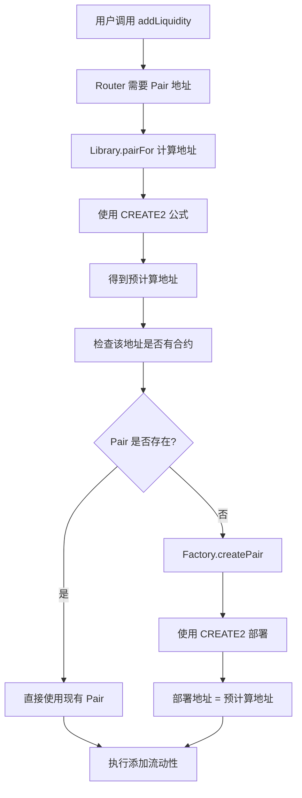

# Init Code Hash 可视化解释

## 🎯 核心问题

**如何在不部署合约的情况下，提前知道合约的地址？**

```
传统方式 (CREATE):
部署合约 → 获得随机地址 → 无法预测

CREATE2 方式:
输入确定参数 → 计算确定地址 → 可以预测！
```

## 🧮 CREATE2 地址计算公式

```
地址 = keccak256(0xff + 部署者 + salt + initCodeHash)[12:]
```

### 参数解释：

```
┌─────────────────────────────────────────────────────────────┐
│                    CREATE2 地址计算                          │
├─────────────────────────────────────────────────────────────┤
│ 0xff          │ CREATE2 标识符 (固定值)                      │
│ 部署者        │ Factory 合约地址                             │
│ salt          │ keccak256(token0 + token1)                  │
│ initCodeHash  │ keccak256(UniswapV2Pair.creationCode)      │
└─────────────────────────────────────────────────────────────┘
```

## 🔄 Uniswap V2 执行流程

### 场景：用户想要添加流动性



## 📊 实际数据演示

基于我们的演示脚本结果：

```
🏭 Factory 地址:     0x5FbDB2315678afecb367f032d93F642f64180aa3
🪙 Token A:          0xe7f1725E7734CE288F8367e1Bb143E90bb3F0512  
🪙 Token B:          0x9fE46736679d2D9a65F0992F2272dE9f3c7fa6e0

📐 计算过程:
1️⃣ 排序代币:
   token0 = 0x9fE46736679d2D9a65F0992F2272dE9f3c7fa6e0 (较小)
   token1 = 0xe7f1725E7734CE288F8367e1Bb143E90bb3F0512 (较大)

2️⃣ 计算 Salt:
   salt = keccak256(token0 + token1)
   = 0xc3b0d39761744182021d8af997620e6e165f9367a41749d68674580739a31e66

3️⃣ Init Code Hash:
   = 0xd5d6b1b6f5b831abf9fef3ff763438b9b00975309b419df80a952304942cfbd4

4️⃣ CREATE2 计算:
   地址 = keccak256(
     0xff +
     0x5FbDB2315678afecb367f032d93F642f64180aa3 +
     0xc3b0d39761744182021d8af997620e6e165f9367a41749d68674580739a31e66 +
     0xd5d6b1b6f5b831abf9fef3ff763438b9b00975309b419df80a952304942cfbd4
   )[12:]

🎯 结果:
   预计算地址: 0x85dede8fd2a5cc14925cbe61c57c68d1860f539e
   实际地址:   0x85DEdE8FD2a5cC14925CBE61C57c68d1860F539E
   ✅ 完全匹配！
```

## ⚡ 为什么这样设计？

### 🚀 优势对比

| 传统方式 (CREATE) | CREATE2 方式 |
|------------------|-------------|
| 🐌 必须先部署才知道地址 | ⚡ 可以预先计算地址 |
| 💸 浪费 Gas（可能重复部署） | 💰 节省 Gas（按需部署） |
| 🔄 需要多步操作 | ⚡ 单步原子操作 |
| 😕 用户体验差 | 😊 用户体验好 |

### 🎯 实际好处

1. **Gas 效率**：
   ```solidity
   // 不需要这样做：
   address pair = factory.createPair(tokenA, tokenB);  // 消耗 Gas
   // 可以直接：
   address pair = Library.pairFor(factory, tokenA, tokenB);  // 纯计算
   ```

2. **原子性**：
   ```solidity
   // 一个交易内完成：
   function addLiquidity(...) {
       address pair = Library.pairFor(factory, tokenA, tokenB);  // 计算地址
       if (factory.getPair(tokenA, tokenB) == address(0)) {
           factory.createPair(tokenA, tokenB);  // 按需创建
       }
       // 直接使用
       TransferHelper.safeTransferFrom(tokenA, msg.sender, pair, amountA);
   }
   ```

## ⚠️ 常见错误

### 🚨 Init Code Hash 不匹配

```
❌ 错误场景:
Library 中的 Hash: 0x1234...  (旧的或错误的)
实际 Pair 的 Hash:  0xd5d6...  (当前正确的)

💥 结果:
预计算地址: 0xf61e226ba8f0a1b2056bf897878b93035eedd02a
实际地址:   0x85DEdE8FD2a5cC14925CBE61C57c68d1860F539E

🔥 错误信息:
"function call to a non-contract account"
```

### 🛠️ 解决方案

1. **重新计算 Hash**：
   ```javascript
   const Pair = await ethers.getContractFactory("UniswapV2Pair");
   const initCodeHash = ethers.keccak256(Pair.bytecode);
   ```

2. **更新 Library**：
   ```solidity
   // 在 UniswapV2Library.sol 中更新
   hex'd5d6b1b6f5b831abf9fef3ff763438b9b00975309b419df80a952304942cfbd4'
   ```

## 🎓 学习要点

1. **Init Code Hash 是什么**：
   - Pair 合约创建字节码的 keccak256 哈希值
   - 用于 CREATE2 地址计算的关键参数

2. **为什么需要它**：
   - 实现确定性地址计算
   - 提高 Gas 效率和用户体验
   - 支持原子性操作

3. **如何保持正确**：
   - 每次修改 Pair 合约后重新计算
   - 在部署前验证 Hash 的正确性
   - 使用自动化脚本检查一致性

4. **设计哲学**：
   - 这是 CREATE2 的绝佳应用案例
   - 展示了如何用密码学解决工程问题
   - 体现了 DeFi 协议的精巧设计

## 🔗 相关概念

- **CREATE2 操作码**：以太坊的确定性合约部署
- **Factory 模式**：统一管理合约创建
- **Salt 机制**：确保不同输入产生不同地址
- **字节码哈希**：合约代码的唯一标识

这种设计不仅在 Uniswap V2 中使用，也被许多其他 DeFi 协议采用，是现代智能合约架构的重要组成部分。 